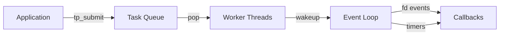

# tread_pool

Simple tread pool on C for Unix-like systems, tested on ubuntu, macOS and FreeBSD. 

## Features

## Architecture

The library implements a hybrid Half-Sync/Half-Reactor model, 
one event-pool monitors file descriptors and timers, and the POSIX thread pool processes tasks from a thread-safe queue.

## Quick Start

## API Reference

